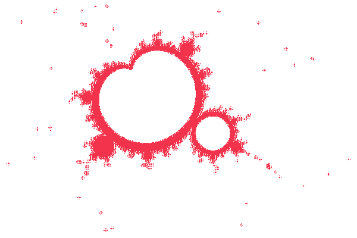
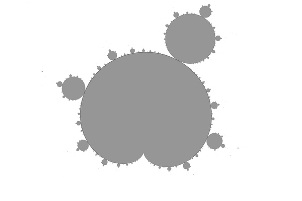
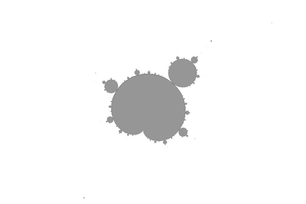

# Mandelbrot-set-topology
Mandelbrot set topology

How to read informations from images ?

How to describe hyperbolic component of Mandelbrot set ? ( escpecially [island](https://en.wikibooks.org/wiki/Fractals/Iterations_in_the_complex_plane/island_t) )
* period of main pseudocardioid
* center of main pseudocardioid
* window ( radius and center) of parameter plane
* angles of external rays that land on cusp of the pseudocardiod
* size of main pseudocardioid
* orientation
* [distortion](https://en.wikibooks.org/wiki/Fractals/Iterations_in_the_complex_plane/Mandelbrot_set/mset_distortion)

# To do

For each island: 
* find period 
* find center of component ( nucleus)
* find shape ( psudocircle or pseudocardioid)
* find cusp of pseudorardioid
* find root point between 2 main componnents
* compute [distortion of the island](https://en.wikibooks.org/wiki/Fractals/Iterations_in_the_complex_plane/Mandelbrot_set/mset_distortion)


# Example islands

Here are few examples of [islands](https://en.wikibooks.org/wiki/Fractals/Iterations_in_the_complex_plane/island_t). 
* first image ( LastIteration = 108):  shows interior points
* second image (Period = 107): Only main (pseudo)cardioid of period p  and main component of period 2p is drawn 
* for more description see the [output txt file m.txt](./src/cli/m.txt)

```c
#define kMax 12 // number of examples, see line 211 plane_examples

// plane_center_x	plane_center_y	plane_radius	island_period
double plane_examples[kMax][4] = {
	{-0.4,		+0.0,		0.8,		1}, 
	{+0.2925755,	-0.0149977, 	0.00025,	16}, 
	{-1.763,  	+0.0,		0.016,		3}, 
	{-0.15842, 	+1.03335, 	0.01,		4},  
	{+0.358431,	+ 0.643507,	0.006,		5},  
	{+0.442990,	+0.373727,	0.005,		6}, 
	{+0.432259,	+0.227315,	0.003,		7}, 
	{+0.404879,	+0.146216,	0.002,		8}, 
	{+0.378631,	+0.098841,	0.001,		9}, 
	{+0.356854, 	+0.069659,	0.001,		10},
	{+0.339454,	+0.050823,	0.001,		11},
	{+0.325631,	+0.038164,	0.001,		12}
	 
};
```
## Period 1
peroid = 1 = whole Mandelbrot set  ( using LastIterarion method with interior detection)

 

Here unknown pixels are marked by red big pixels. They are boundary points. 

 

 

## Period 16 island

 

Here are 2 main components : period 16 pseudocardioid and period 2*16 pseudocircle. Note that the image differs from that computed with LastIteration method ( above). 
The components are smaller and do not touch in root points

 

Here is comparison using ImageMagic ( [see bash file](./src/cli/m.sh))

 

Here is a comparison between boundaries of LastIterarion method and Period method. The difference is big. It was caused by to low value of iMax = 2000; ( see function GivePeriodByIteration line 676 )

 

After increasing iMax (10 000 and 50 000) ( and orbit[OrbitLength]; // length(orbit) = iMax + 1 ) new image looks better 

 

 


## Period 3

Period 3 island looks like whole Mandelbrot set  

 

 

## Period 4

 

 

## Period 5
 

 

## Period 6

 

## Period 7
 

## Period 8
 

## Period 9

 

## Period 10

 

## Period 11



## Period 12 

 

 


# Files
* [m.c](./src/cli/m.c) - one file c program
* [m.sh](./src/cli/m.sh) - bash file used to compile, run the m.c and image manipulations using ImageMagic console programs
* [Makefile](./src/cli/Makefile) file for make which runs all
* [output txt file m.txt](./src/cli/m.txt) - to read about the results
* [images are in the png directory](./png/) 


# Algorithms
* [atom domains for period  (= period domains) of Mandelbrot set hyperbolic components](https://commons.wikimedia.org/wiki/File:Mandelbrot_Atom_Domains_Animation.gif)
* period of Mandelbrot set hyperbolic componnets
* [multiplier map](https://commons.wikimedia.org/wiki/File:Mandelbrot_set_-_multiplier_map.png)
* [interior detection](https://commons.wikimedia.org/wiki/File:Mandelbrot_set_with_Interior_detection_method.png)
* [The Lyapunov exponent](https://en.wikibooks.org/wiki/Fractals/Iterations_in_the_complex_plane/Mandelbrot_set_interior)
* [Interior distance estimation](https://en.wikibooks.org/wiki/Fractals/Iterations_in_the_complex_plane/demm#Interior_distance_estimation) - DEM 
* [rendering-mandelbrot-set-mu-units](https://fractalforums.org/code-snippets-fragments/74/rendering-mandelbrot-set-mu-units/3485): How to extract a mu-unit of a given period using distance estimation colouring, pruning off the outer filaments?
* [mu-atom ](https://mathr.co.uk/mandelbrot/mu-atom/) - mu-atom mapping: period p hyperbolic components of the Mandelbrot set can each be mapped conformally to the unit disc, by the derivative d/dz of the periodic limit cycle where f_c^p(z_0) = z_0.
* [period-doubling-in-minibrots](https://fractalforums.org/noobs-corner/76/period-doubling-in-minibrots/3990)

# Key words
* [distortion](https://en.wikibooks.org/wiki/Fractals/Iterations_in_the_complex_plane/Mandelbrot_set/mset_distortion)
* [computational topology](https://en.wikipedia.org/wiki/Computational_topology)
* [digital topology](https://en.wikipedia.org/wiki/Digital_topology)
* 2D 
* [raster graphic](https://en.wikipedia.org/wiki/Raster_graphics)
* computer graphic
* [binary image](https://en.wikipedia.org/wiki/Binary_image)
* [Connected-component labeling](https://en.wikipedia.org/wiki/Connected-component_labeling)


# Git

create a new repository on the command line
```
echo "# " >> README.md
git init
git add README.md
git commit -m "first commit"
git branch -M main
git remote add origin git@github.com:adammaj1/Mandelbrot-set-topology.git
git push -u origin main
```


## Repo

Change:
* in general settings
  * add Social Preview Image ( Images should be at least 640×320px (1280×640px for best display))
* in repository details ( near About) add
  * description
  * website 
  * Topics (separate with spaces) 
  

Local repository

```
~/Dokumenty/Mandelbrot-set-topology/ 

```


## Subdirectory

```git
mkdir png
git add *.png
git mv  *.png ./png
git commit -m "move"
git push -u origin main
```
then link the images:

```txt
 

```

to overwrite

```
git mv -f 
```

```
git mv ./src/*.c ./src/modified/bash/
git mv ./src/*.sh ./src/modified/bash/
gitt mv ./src/Makefile ./src/modified/bash/
```


## Github
* [GitHub Flavored Markdown Spec](https://github.github.com/gfm/)
* [md cheat sheet](http://mdcheatsheet.com/)
* [CommonMark Spec](https://spec.commonmark.org)
* [Markdown parser ](https://markdown-it.github.io/)

