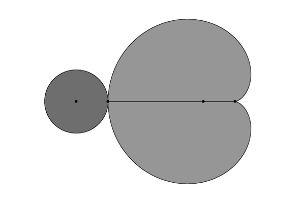
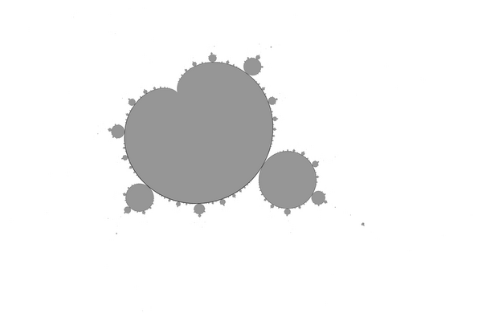
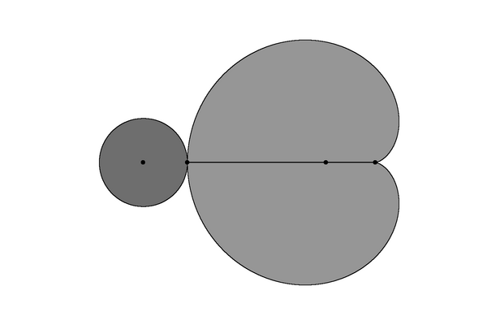
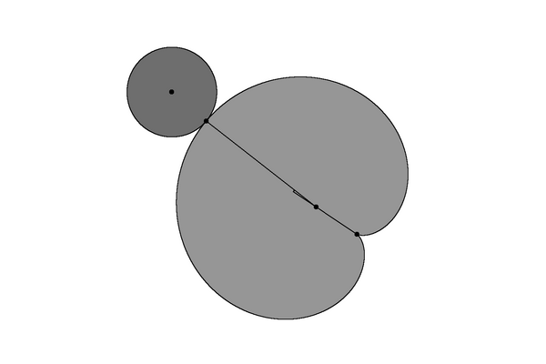
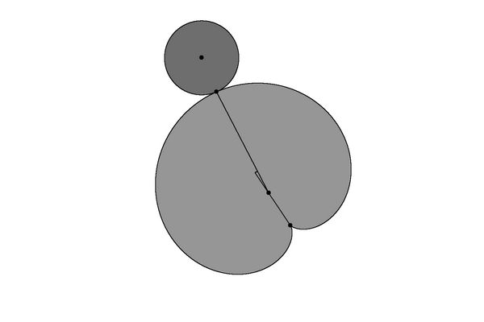
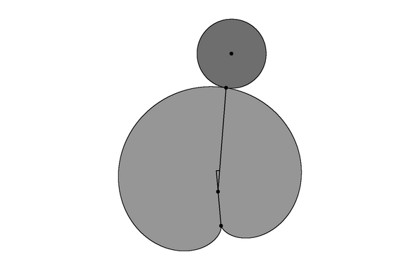
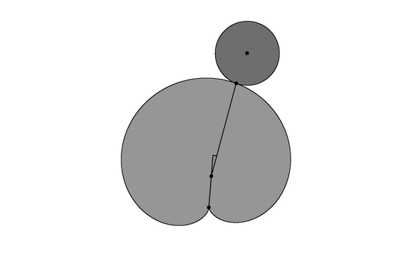
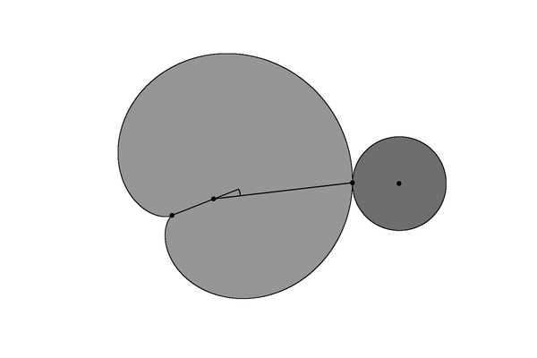

# Mandelbrot-set-topology
Mandelbrot set topology

How to read informations from images ?

How to describe hyperbolic component of Mandelbrot set ? ( escpecially [island](https://en.wikibooks.org/wiki/Fractals/Iterations_in_the_complex_plane/island_t) )
* period of main pseudocardioid
* center of main pseudocardioid
* window ( radius and center) of parameter plane
* angles of external rays that land on cusp of the pseudocardiod
* size of main pseudocardioid
* orientation
* [distortion](https://en.wikibooks.org/wiki/Fractals/Iterations_in_the_complex_plane/Mandelbrot_set/mset_distortion)

# To do

For each island: 
* find period 
* find center of component ( nucleus) = pseudocardioid_nucleus
* find shape ( psudocircle or pseudocardioid)
* find cusp of pseudocardioid = pseudocardioid_cusp
* find root point between 2 main componnents = pseudocardioid_root_half
* find center of second component ( nucleus) = second_bulb_nucleus
* compute [distortion of the island](https://en.wikibooks.org/wiki/Fractals/Iterations_in_the_complex_plane/Mandelbrot_set/mset_distortion)


# Example islands

Here are few examples of [islands](https://en.wikibooks.org/wiki/Fractals/Iterations_in_the_complex_plane/island_t). 
* first image ( LastIteration = 108):  shows interior points
* second image (Period = 107): Only main (pseudo)cardioid of period p  and main component of period 2p is drawn 
* for more description see the [output the new txt file m.txt](./src/cli/new/m.txt) and [output the old txt file m.txt](./src/cli/old/m.txt)

```c
#define kMax 21 // number of examples, see plane_examples

//plane : plane_center_x,  		plane_center_y,  		plane_radius, 		period

double plane_examples[kMax][4] = {
	{-0.4,				+0.0,				0.8,			1}, // k = 0
	{+0.29254,			-0.01497, 			0.00015,		16}, 
	{-1.763,  			+0.0,				0.016,			3}, 
	{-0.15842, 			+1.03335, 			0.008,			4},  
	{+0.358431,			+0.643507,			0.005,			5},  
	{+0.442990,			+0.374,				0.003,			6},  
	{+0.432259,			+0.2275,			0.002,			7}, 
	{+0.404879,			+0.146216,			0.0015,			8}, 
	{+0.378631,			+0.098841,			0.001,			9}, 
	{+0.356854, 			+0.069659,			0.0007,			10},
	{+0.339454,			+0.050823,			0.0005,			11}, // k = 10
	{+0.325631,			+0.038164,			0.0005,			12},
	{+0.260270,		 	+0.00167,			0.00002, 		32 },
	{+0.2524945,			+0.0001973,			0.0000025,		64},
	{+0.25061329,			+0.00002399,			0.0000003,		128},
	{+0.250151979,			+0.000002959,			0.000000036,		256},
	{+0.250037823,			+0.0000003673,			0.000000004,		512}, 
	{+0.2500094342,			+0.000000045694786520646,	0.0000000005,		1024}, //
	{+0.25000235583,		+5.701985912706845832e-09,	0.00000000007,		2048}, // 
	{+0.2500005886144,		+0.0000000007122,		0.0000000000083,	4096}, //
	{+2.500001471109009610e-01,	+8.897814201389663379e-11,	1.1e-12,		8192}  //  long time 
	 
};

```
## Period 1
peroid = 1 = whole Mandelbrot set  ( using LastIterarion method with interior detection)

 

Here unknown pixels are marked by red big pixels. They are boundary points. 

 

 


With important points: pseudocardioid_nucleus, pseudocardioid_cusp, pseudocardioid_root_half, second_bulb_nucleus  



Here distortion angle = 0.0000000000000070 ( it is = 0, the number 7 on the penultimate position is numerical error) 


## Period 16 island

 

Here are 2 main components : period 16 pseudocardioid and period 2*16 pseudocircle. Note that the image differs from that computed with LastIteration method ( above). 
The components are smaller and do not touch in root points

 

Here is the comparison using ImageMagic ( [see bash file](./src/cli/old/m.sh))

 

Here is a comparison between boundaries of LastIterarion method and Period method. The difference is big. It was caused by to low value of iMax = 2000; ( see function GivePeriodByIteration line 676 )

 

After increasing iMax (10 000 and 50 000) ( and orbit[OrbitLength]; // length(orbit) = iMax + 1 ) new image looks better 

 

 


With 
* important points: pseudocardioid_nucleus, pseudocardioid_cusp, pseudocardioid_root_half, second_bulb_nucleus  
* 2 axis, one thru pseudocardioid_nucleus and pseudocardioid_cusp, second thru  pseudocardioid_nucleus and pseudocardioid_root_half
* distorsion angle is denoted with arc

 

Here distortion angle = 10.2217850853740675 degrees = 0.0283938474593724 turns = 585.6651445133592233 radians 


## Period 3

Period 3 island looks like whole Mandelbrot set  

 

 

With important points, axes and distortion angle 

 

Here distortion angle = 0.0000000000000066 degrees = 0.0000000000000000 turns = 0.0000000000003803 radians ( it is = 0, the numbers on the penultimate and last positions are numerical errors) 

## Period 4

 

Here distortion angle = 3.1678661702170463 degrees = 0.0087996282506029 turns = 

## Period 5

 

## Period 6


 

## Period 7

 

## Period 8

 

## Period 9


 

## Period 10


 

## Period 11


 

## Period 12 

 


## Period 32 

 


## Period 64 

 


## Period 128

 


## Period 256

 


## Period 512 

 


## Period 1024 

 

## Period 2048 

 


## Period 4096 

 


## Period 8192 

 


# Results
```
Period 1	nucleus = +0.0000000000000000 +0.0000000000000000	distortion angle = 0.0000000000000070 degrees = 0.0000000000000000 turns = 0.0000000000004020 radians 		island sizes: HalfRoot-Cusp  = 1.0000000000000000 
Period 3	nucleus = -1.7548776662466927 +0.0000000000000000	distortion angle = 0.0000000000000066 degrees = 0.0000000000000000 turns = 0.0000000000000001 radians 		island sizes: HalfRoot-Cusp  = 0.0185291524676852  
Period 4 	nucleus = -0.1565201668337551 +1.0322471089228318	distortion angle = 3.1678661702170463 degrees = 0.0087996282506029 turns = 0.0552896949298424 radians	 	island sizes: HalfRoot-Cusp  = 0.0082966360777899  
Period 5 	nucleus = +0.3592592247580074 +0.6425137371385423	distortion angle = 4.9405365983730638 degrees = 0.0137237127732585 turns = 0.0862286304522303 radians		island sizes: HalfRoot-Cusp  = 0.0047414665489602 
Period 6 	nucleus = +0.4433256333996235 +0.3729624166628465	distortion angle = 6.1617377889422356 degrees = 0.0171159383026173 turns = 0.1075426120557851 radians		island sizes: HalfRoot-Cusp  = 0.0029786183826876   
Period 7 	nucleus = +0.4323761926419945 +0.2267599044353486	distortion angle = 7.0832512125542779 degrees = 0.0196756978126508 turns = 0.1236260553982713 radians		island sizes: HalfRoot-Cusp  = 0.0019783278097542  
Period 8 	nucleus = +0.4048996651751222 +0.1458203637665893	distortion angle = 7.8032252414405772 degrees = 0.0216756256706683 turns = 0.1361919727305068 radians		island sizes: HalfRoot-Cusp  = 0.0013689191712135   
Period 9 	nucleus = +0.3786081241329295 +0.0985580111183820	distortion angle = 8.3732692725677360 degrees = 0.0232590813126882 turns = 0.1461411179544790 radians	 	island sizes: HalfRoot-Cusp  = 0.0009793927717717  
Period 10 	nucleus = +0.3568172484923120 +0.0694528654668303	distortion angle = 8.8278041145438362 degrees = 0.0245216780959551 turns = 0.1540742475115654 radians	 	island sizes: HalfRoot-Cusp  = 0.0007208567191598
Period 11 	nucleus = +0.3394108199955985 +0.0506682851626426	distortion angle = 9.1924920908597691 degrees = 0.0255347002523882 turns = 0.1604392534403695 radians		island sizes: HalfRoot-Cusp  = 0.0005437231668462  
Period 12 	nucleus = +0.3255895095506603 +0.0380478809347557	distortion angle = 9.4870876692376047 degrees = 0.0263530213034378 turns = 0.1655809162446018 radians		island sizes: HalfRoot-Cusp  = 0.0004189608583239  
Period 16	nucleus = +0.2925037532341934 -0.0149250689983438	distortion angle = 10.2217850853740675 degrees = 0.0283938474593724 turns = 0.1784038051613850 radians 		island sizes: HalfRoot-Cusp  = 0.0001743936505473  
Period 32 	nucleus = +0.2602618199285007 +0.0016677913209265	distortion angle = 10.9845361225518747 degrees = 0.0305126003404219 turns = 0.1917163221324199 radians		island sizes: HalfRoot-Cusp  = 0.0000205403237492
Period 64 	nucleus = +0.2524934589775105 +0.0001971526796077	distortion angle = 11.1719775049860850 degrees = 0.0310332708471836 turns = 0.1949877914102099 radians		island sizes: HalfRoot-Cusp  = 0.0000024544115792 
Period 128 	nucleus = +0.2506132008410751 +0.0000239693264251	distortion angle = 11.2171220053156571 degrees = 0.0311586722369879 turns = 0.1957757115800861 radians		island sizes: HalfRoot-Cusp  = 0.0000002990710383  
Period 256 	nucleus = +0.2501519680089798 +0.0000029549623259	distortion angle = 11.2283621916479994 degrees = 0.0311898949768000 turns = 0.1959718898401125 radians		island sizes: HalfRoot-Cusp  = 0.0000000368869447  
Period 512 	nucleus = +0.2500378219137853 +0.0000003668242053	distortion angle = 11.2312909069159588 degrees = 0.0311980302969888 turns = 0.1960230055643890 radians		island sizes: HalfRoot-Cusp  = 0.0000000045794813  
Period 1024 	nucleus = +0.2500094340031834 +0.0000000456947865	distortion angle = 11.2320980460567430 degrees = 0.0312002723501576 turns = 0.1960370927999167 radians		island sizes: HalfRoot-Cusp  = 0.0000000005704648  
Period 2048 	nucleus = +0.2500023558032561 +0.0000000057019859	distortion angle = 11.2323756629140412 degrees = 0.0312010435080946 turns = 0.1960419381281353 radians		island sizes: HalfRoot-Cusp  = 0.0000000000711847  
Period 4096 	nucleus = +0.2500005886128087 +0.0000000007121327	distortion angle = 11.2321190246282825 degrees = 0.0312003306239675 turns = 0.1960374589450624 radians		island sizes: HalfRoot-Cusp  = 0.0000000000088904  
Period 8192 	nucleus = +0.2500001471109010 +0.0000000000889781	distortion angle = 11.2329396859086224 degrees = 0.0312026102386351 turns = 0.1960517821864472 radians		island sizes: HalfRoot-Cusp  = 0.0000000000011108 
```


# Files
* [m.c](./src/cli/new/m.c) - one file c program
* [m.sh](./src/cli/new/m.sh) - bash file used to compile, run the m.c and image manipulations using ImageMagic console programs
* [Makefile](./src/cli/new/Makefile) file for make which runs all
* [output txt file m.txt](./src/cli/new/m.txt) - to read about the results
* [old code](./src/cli/old/) 
* [images are in the png directory](./png/) 


# Algorithms
* [math SE question: function-to-calculate-the-period-of-a-mandelbrot-set-point](https://math.stackexchange.com/questions/4502546/function-to-calculate-the-period-of-a-mandelbrot-set-point)
* [atom domains for period  (= period domains) of Mandelbrot set hyperbolic components](https://commons.wikimedia.org/wiki/File:Mandelbrot_Atom_Domains_Animation.gif)
* period of Mandelbrot set hyperbolic componnets
* [multiplier map](https://commons.wikimedia.org/wiki/File:Mandelbrot_set_-_multiplier_map.png)
* [interior detection](https://commons.wikimedia.org/wiki/File:Mandelbrot_set_with_Interior_detection_method.png)
* [The Lyapunov exponent](https://en.wikibooks.org/wiki/Fractals/Iterations_in_the_complex_plane/Mandelbrot_set_interior)
* [Interior distance estimation](https://en.wikibooks.org/wiki/Fractals/Iterations_in_the_complex_plane/demm#Interior_distance_estimation) - DEM 
* [rendering-mandelbrot-set-mu-units](https://fractalforums.org/code-snippets-fragments/74/rendering-mandelbrot-set-mu-units/3485): How to extract a mu-unit of a given period using distance estimation colouring, pruning off the outer filaments?
* [mu-atom ](https://mathr.co.uk/mandelbrot/mu-atom/) - mu-atom mapping: period p hyperbolic components of the Mandelbrot set can each be mapped conformally to the unit disc, by the derivative d/dz of the periodic limit cycle where f_c^p(z_0) = z_0.
* [period-doubling-in-minibrots](https://fractalforums.org/noobs-corner/76/period-doubling-in-minibrots/3990)
* [shape estimation]()


Description
* all calculations are in a point-sampling, numerical ( double precision), non-rounding controlled manner
* execution time of DrawImage for LastIteration = 31 	for Period = 525 	MultiplierMap = 5 seconds for example 2 ( period 3)


# Key words
* [distortion](https://en.wikibooks.org/wiki/Fractals/Iterations_in_the_complex_plane/Mandelbrot_set/mset_distortion)
* [computational topology](https://en.wikipedia.org/wiki/Computational_topology)
* [digital topology](https://en.wikipedia.org/wiki/Digital_topology)
* 2D 
* [raster graphic](https://en.wikipedia.org/wiki/Raster_graphics)
* computer graphic
* [binary image](https://en.wikipedia.org/wiki/Binary_image)
* [Connected-component labeling](https://en.wikipedia.org/wiki/Connected-component_labeling)


# See also
* [Mandelbrot in C language with arbitrary precision by Jose Celano](https://github.com/josecelano/c-mandelbrot-arbitrary-precision)


# Git

create a new repository on the command line
```
echo "# " >> README.md
git init
git add README.md
git commit -m "first commit"
git branch -M main
git remote add origin git@github.com:adammaj1/Mandelbrot-set-topology.git
git push -u origin main
```


## Repo

Change:
* in general settings
  * add Social Preview Image ( Images should be at least 640×320px (1280×640px for best display))
* in repository details ( near About) add
  * description
  * website 
  * Topics (separate with spaces) 
  

Local repository

```
~/Dokumenty/Mandelbrot-set-topology/ 

```


## Subdirectory

```git
mkdir png
git add *.png
git mv  *.png ./png
git commit -m "move"
git push -u origin main
```
then link the images:

```txt
 

```

to overwrite

```
git mv -f 
```
the other files

```
git mv ./src/*.c ./src/modified/bash/
git mv ./src/*.sh ./src/modified/bash/
git mv ./src/Makefile ./src/modified/bash/
```


## Github
* [GitHub Flavored Markdown Spec](https://github.github.com/gfm/)
* [md cheat sheet](http://mdcheatsheet.com/)
* [CommonMark Spec](https://spec.commonmark.org)
* [Markdown parser ](https://markdown-it.github.io/)

